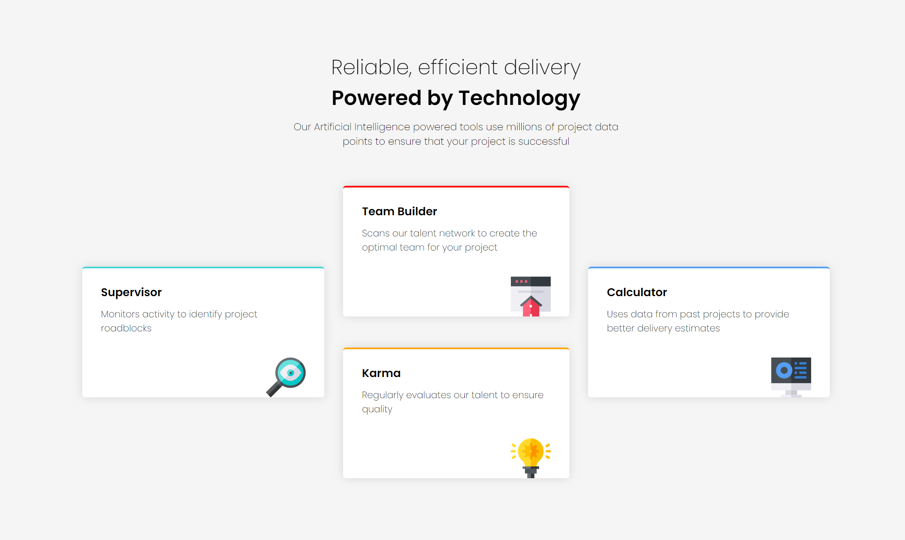

# Frontend Mentor - Four card feature solution

This is a solution to the [Four card feature section challenge on Frontend Mentor](https://www.frontendmentor.io/challenges/four-card-feature-section-weK1eFYK). Frontend Mentor challenges help you improve your coding skills by building realistic projects.

## Overview

### Screenshot

### Links

- Live Site URL: [GitHub Pages link](https://kasia307584.github.io/challenge_Four-Card-Section/)

### The challenge

Users should be able to:

- View the optimal layout for the site depending on their device's screen size

## My process

### Built with

- Semantic HTML5 markup
- CSS Grid

### What I learned

- Use `CSS Grid`
- Responsive design

## Author

- Frontend Mentor - [My Profile Page link](https://www.frontendmentor.io/profile/Kasia307584)
